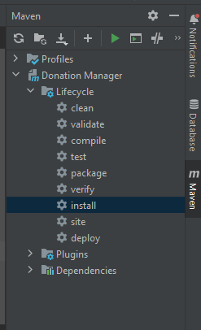
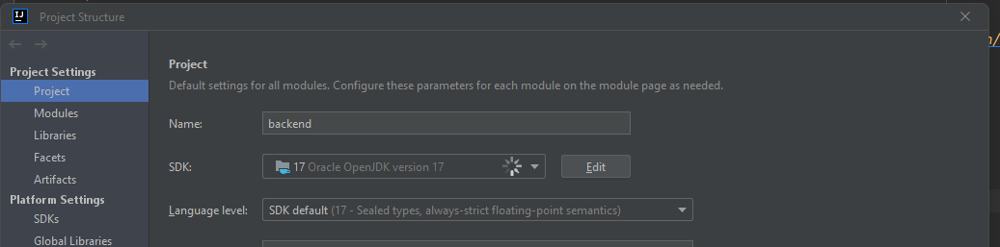

    # Backend

This project was created at the java training 2023. It is expected to work with [this](https://github.com/kedith/frontend) frontend and expects a running mqSql DB.

## Prerequisites

- java 17, go to the [Install guide](#tool-install-guide)
- maven installed (try to use your current maven config if you have one); you can download maven 3.6.3
  from [here](https://repo.maven.apache.org/maven2/org/apache/maven/apache-maven/3.6.3/apache-maven-3.6.3-bin.zip)

## How to test locally

Use the Maven build interface from Intellij to build and run the project - this will ensure you are using the project
specific java version 17:



### Build & run

0. Start mysql
   db: ``` docker run --name mysql -e MYSQL_ROOT_PASSWORD=password -e MYSQL_DATABASE=donationmanager -d -p 3306:3306 --restart unless-stopped mysql:8.0.34```

  - sets the password of the root user to ```password```
  - automatically creates the database ```donationmanager```
  - maps the internal container port ```3306``` to the same on your ```localhost```

Check the logs to see if it started ok: ```docker logs mysql```

**NOTE** execute the first time: [initialize database data](#setup-database-data)
1. Run ```mvn install``` from the Intellij UI
2. Go to ```DonationManagerApplication.java``` and run that class

## Tool install guide

This section describes how to configure the project specific requirements locally in intellij and not globally for all
your projects

### Java

- jdk 17 install link: https://download.java.net/openjdk/jdk17.0.0.1/ri/openjdk-17.0.0.1+2_windows-x64_bin.zip
- unpack the contents of the downloaded zip into ```C:\tools\jdk17```
- Go in Intellij to ```File``` > ```Project Settings``` and add the new folder you just created in the add sdk dropdown:
  

## Setup database data

Run the ```src/main/resources/dataBaseStructureTestData.sql``` script when you need to initialize the db with data and
to create the necessary tables. To run it, select the database in the db view of intellij and open a new query console
where you can copy the content of the script and execute it
